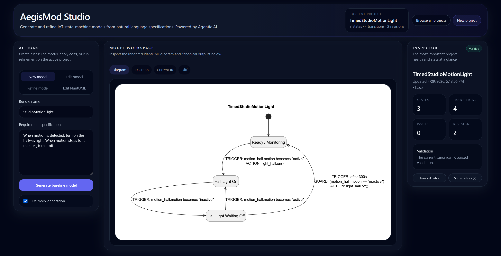
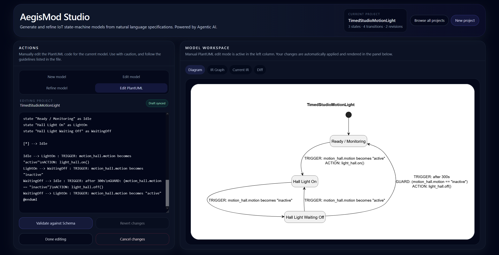

# AegisMod Studio User Guide

AegisMod Studio is the frontend interface for the NL → IR → PlantUML pipeline. It lets users generate, inspect, edit, validate, and refine IoT state-machine models without needing to run every pipeline command manually from the terminal.

The Studio is useful for two types of users:

- **Non-technical users** can enter natural-language requirements, view the generated diagram, request changes in plain English, and inspect validation status.
- **Technical users** can inspect the generated IR, review diffs, directly edit PlantUML, and round-trip edits back into the canonical IR.

The UI turns the pipeline from a strict one-way sequence into an interactive tool suite: users can generate a baseline model, inspect artifacts, apply manual edits, request agentic edits, rerun validation, and refine the model at different stages.

---

## 1. Prerequisites

Before using AegisMod Studio, make sure the backend pipeline can run from the repository root.

### Required

- Python 3.10+
- Node.js 20+
- npm

### Optional but recommended

- OpenAI API key for LLM-backed generation and agentic editing
- Java and Graphviz for local PlantUML rendering
- `tools/plantuml.jar` if using local PlantUML rendering

---

## 2. Repository Layout

Relevant folders:

```text
repo-root/
  src/                  Core backend pipeline implementation
  templates/            IR schema and device/capability catalogs
  tools/                Optional tools such as plantuml.jar
  studio/               AegisMod Studio frontend
  outputs/              Generated project/bundle artifacts
  docs/                 Recommended location for this guide and screenshots
```

Generated project artifacts are written under:

```text
outputs/<BundleName>/
  baseline/
    final.ir.json
    final.puml
    validation_report.json
  current/
    final.ir.json or current IR snapshot
    final.puml or current PlantUML snapshot
    validation_report.json
  edits/
    edit_001/
    edit_002/
    ...
  manifest.json
```

The exact filenames may vary slightly depending on the command or revision type, but the important idea is:

- `baseline/` stores the initial generated model.
- `current/` stores the active canonical version.
- `edits/` stores revision history from manual edits, agentic edits, and refinement.
- `manifest.json` stores project metadata and revision pointers.

---

## 3. Starting AegisMod Studio

AegisMod Studio requires two processes:

1. the backend API, started from the repository root;
2. the frontend development server, started from the `studio/` folder.

### 3.1 Start the backend

From the repository root:

```powershell
py -m venv .venv
.\.venv\Scripts\Activate.ps1
pip install -e ".[studio]"
```

Then start the Studio backend:

```powershell
nlpipeline studio --host 127.0.0.1 --port 8000
```

Keep this terminal window open.

### 3.2 Start the frontend

Open a second PowerShell window:

```powershell
cd studio
npm install
npm run dev
```

Then open the URL shown in the terminal. By default, this is usually:

```text
http://127.0.0.1:5173
```

### 3.3 Optional: configure a different backend URL

The frontend defaults to:

```text
http://127.0.0.1:8000
```

If the backend is running somewhere else, create or update a frontend environment file in `studio/`:

```env
VITE_API_BASE_URL=http://127.0.0.1:8000
```

Restart the frontend after changing this value.

---

## 4. Optional OpenAI Setup

For LLM-backed generation, agentic editing, and refinement, create a `.env` file in the repository root:

```env
OPENAI_API_KEY=YOUR_KEY_HERE
OPENAI_MODEL=gpt-5
```

Install the OpenAI extra if needed:

```powershell
pip install -e ".[openai]"
```

In the Studio UI, the **Use mock generation** checkbox controls whether the Studio uses mock/demo behavior or LLM-backed behavior for supported operations.

For quick demos, leave **Use mock generation** checked.

For real model generation/editing, uncheck **Use mock generation** and make sure your `.env` file is configured.

---

## 5. Interface Overview

AegisMod Studio is organized around three main areas.



### 5.1 Header

The top header shows:

- the Studio title;
- the currently selected project;
- the number of states, transitions, and revisions;
- buttons to browse all projects or start a new project.

### 5.2 Actions panel

The left-side **Actions** panel controls what operation you want to perform. It has four modes:

| Mode | Purpose |
|---|---|
| **New model** | Create a baseline model from a natural-language requirement. |
| **Edit model** | Ask the agent to modify the current model using natural language. |
| **Refine model** | Run the repair/refinement loop on the current model. |
| **Edit PlantUML** | Manually edit the generated PlantUML and round-trip it back into IR. |

### 5.3 Model workspace

The central **Model Workspace** displays the current artifacts. It includes tabs for:

| Tab | Purpose |
|---|---|
| **Diagram** | Rendered PlantUML state machine. |
| **IR Graph** | Visual or graph-style view of the current IR. |
| **Current IR** | JSON view of the active canonical IR. |
| **Diff** | JSON diff or change summary for the current revision. |

The Diagram tab is the most useful for non-technical inspection. The Current IR and Diff tabs are more useful for technical debugging and validation.

### 5.4 Inspector

The right-side **Inspector** summarizes the active project. It shows:

- project name;
- validation status;
- state count;
- transition count;
- issue count;
- revision count;
- validation diagnostics;
- recent revision history.

Use the Inspector when you want to quickly answer:

- Did the current model validate successfully?
- How many issues remain?
- How many revisions have been created?
- What diagnostics did validation produce?

---

## 6. Creating a New Baseline Model

Use this workflow to generate a new model from natural language.

### Steps

1. Start the backend and frontend.
2. Open AegisMod Studio in the browser.
3. Select **New model** in the Actions panel.
4. Enter a bundle name.

   Example:

   ```text
   StudioMotionLight
   ```

5. Enter a natural-language requirement.

   Example:

   ```text
   When motion is detected, turn on the hallway light. When motion stops for 5 minutes, turn it off.
   ```

6. Choose whether to use mock generation.
   - Keep **Use mock generation** checked for a quick deterministic demo.
   - Uncheck it for LLM-backed generation.
7. Click **Generate baseline model**.
8. Wait for the project to load in the Model Workspace.

### Expected result

After generation, the Studio should display:

- a rendered PlantUML state machine in the Diagram tab;
- the current canonical IR in the Current IR tab;
- validation information in the Inspector;
- generated files under `outputs/<BundleName>/`.

### Output location

For a bundle named `StudioMotionLight`, check:

```text
outputs/StudioMotionLight/
  baseline/
  current/
  manifest.json
```

---

## 7. Browsing and Loading Existing Projects

Use this workflow when you already have generated bundles under `outputs/`.

### Steps

1. Click **Browse all projects** in the top-right header.
2. Search by bundle name if needed.
3. Select a project from the list.
4. The selected project becomes active in the workspace.

### What to check after loading

After loading a project, verify:

- the Diagram tab renders the current model;
- the Inspector shows the expected number of states and transitions;
- the validation status is either **Verified**, **Needs review**, or another status reflecting the current artifact state.

---

## 8. Inspecting a Model

After generating or loading a project, use the Model Workspace tabs to inspect it.

### Diagram

Use the **Diagram** tab to inspect the rendered PlantUML state machine. This is the best view for high-level stakeholder review.

Look for:

- expected states;
- expected transitions;
- trigger labels;
- guard labels;
- action labels;
- unexpected missing behavior;
- extra behavior that was not requested.

### IR Graph

Use the **IR Graph** tab to inspect the model structure in a more IR-focused view.

This view is useful when you want to understand how states and transitions relate without reading raw JSON.

### Current IR

Use the **Current IR** tab to inspect the canonical JSON representation.

This is useful for checking:

- device IDs;
- capability names;
- triggers;
- guards;
- actions;
- state names;
- transition structure.

### Diff

Use the **Diff** tab after edits or refinement to inspect what changed between revisions.

This is useful for checking whether an edit only changed the intended part of the model.

---

## 9. Manual PlantUML Editing

Manual PlantUML editing is intended for technical users who want direct control over the diagram artifact.



### When to use this mode

Use **Edit PlantUML** when you want to:

- rename a state;
- adjust a transition label;
- change a timeout value;
- remove or add a transition;
- make precise structural changes to the state machine;
- test the PlantUML → IR round-trip layer.

### Steps

1. Generate or load a project.
2. Select **Edit PlantUML** in the Actions panel.
3. Edit the PlantUML text in the left-side editor.
4. Watch the Diagram tab update with the edited draft.
5. Click **Validate against Schema** to round-trip the edited PlantUML back into IR and validate it.
6. If validation succeeds, the current project updates to the new canonical artifact.
7. Click **Done editing** when finished.

### Important behavior

The diagram preview may update while you type, but the edit is not fully accepted into the canonical project until you click **Validate against Schema**.

The **Validate against Schema** button performs the backend round-trip workflow:

```text
Edited PlantUML → Parsed IR → Validation → Regenerated current artifacts
```

### Buttons in PlantUML editing mode

| Button | Meaning |
|---|---|
| **Validate against Schema** | Round-trip the edited PlantUML into IR and validate it. |
| **Revert changes** | Restore the editor to the last saved PlantUML. |
| **Done editing** | Leave editing mode. Use this after validating or when you no longer need the editor. |
| **Cancel changes** | Revert unsaved changes and leave editing mode. |

### Safe editing guidelines

When editing PlantUML manually:

- Keep the `@enduml` line.
- Avoid deleting state aliases unless you also update transitions that reference them.
- Keep transition labels in the expected format when possible.
- Preserve trigger/action wording when the behavior should remain unchanged.
- Prefer small edits, then validate.
- Use the Diff tab after validation to confirm that only the intended behavior changed.

### Example edit: change timeout

Original transition label:

```plantuml
WaitingOff --> Idle : TRIGGER: after 300s\nGUARD: (motion_hall.motion == "inactive")\nACTION: light_hall.off()
```

Edited transition label:

```plantuml
WaitingOff --> Idle : TRIGGER: after 600s\nGUARD: (motion_hall.motion == "inactive")\nACTION: light_hall.off()
```

After editing, click **Validate against Schema** and inspect the Diagram, Current IR, and Diff tabs.

---

## 10. Agentic Natural-Language Editing

Agentic editing is intended for users who prefer to describe the desired change in plain English.

### When to use this mode

Use **Edit model** when you want to say what should change without editing PlantUML directly.

Examples:

```text
Change the hallway light timeout from 5 minutes to 10 minutes. Keep the same trigger and devices.
```

```text
Add a notification action that says "House set to away mode." Keep the existing actions.
```

```text
Remove the notification action, but keep the alarm siren action and the Away mode condition.
```

### Steps

1. Generate or load a project.
2. Select **Edit model** in the Actions panel.
3. Write a clear natural-language edit request.
4. Choose whether to use mock generation.
5. Click **Apply edit request**.
6. Inspect the resulting diagram.
7. Check the Diff tab to confirm the requested change was applied.
8. Check the Inspector for validation status and diagnostics.

### Tips for good edit requests

Good edit requests are specific and preservation-oriented.

Use wording like:

```text
Change only the timeout from 300 seconds to 600 seconds. Keep the motion trigger and hallway light actions unchanged.
```

Avoid vague requests like:

```text
Make it better.
```

Recommended structure:

```text
Change [specific part] from [old behavior] to [new behavior]. Keep [important behavior] unchanged.
```

---

## 11. Running the Repair and Refine Loop

The refine workflow runs the validation/repair loop on the current project.

### When to use this mode

Use **Refine model** when:

- the Inspector shows validation issues;
- the current model has structural problems;
- you want the backend repair loop to attempt a fix;
- you want to test later validation and repair layers.

### Steps

1. Generate or load a project.
2. Select **Refine model** in the Actions panel.
3. Choose whether to use mock generation.
4. Click **Run repair and refine loop**.
5. Wait for the workflow to complete.
6. Check the Inspector status.
7. Review the Diagram, Current IR, and Diff tabs.
8. Use **Show history** to inspect the new revision.

### Expected result

If refinement succeeds, the current project should show:

- fewer or no validation issues;
- updated current artifacts;
- a new revision in history;
- a validation status indicating that the current canonical IR passed validation.

---

## 12. Validation and Diagnostics

The Inspector provides the fastest validation summary.

### Status labels

Common status labels include:

| Status | Meaning |
|---|---|
| **Verified** | The current canonical IR passed validation. |
| **Needs review** | Diagnostics are present and should be inspected. |
| **In progress** | A project exists, but a final validation summary may not be available. |
| **Idle** | No project is currently loaded. |

### Show validation

Click **Show validation** to expand diagnostics.

Diagnostics may include:

- severity level;
- diagnostic code;
- message;
- path to the affected IR location.

Use diagnostics to decide whether to:

- manually edit PlantUML;
- request an agentic edit;
- run the refine loop;
- inspect the Current IR directly.

---

## 13. Revision History

AegisMod Studio records revisions for generated and edited projects.

Click **Show history** in the Inspector to view recent revisions.

Revision entries may correspond to:

- baseline generation;
- manual PlantUML round-trip edits;
- agentic edit requests;
- refinement/repair loop runs.

Each revision is also written under the bundle output folder, typically under:

```text
outputs/<BundleName>/edits/
```

Use revision history when you want to verify that an operation created a new artifact snapshot or when you want to compare the current output against a previous state.

---

## 14. Recommended End-to-End Demo

This demo exercises the core Studio workflows.

### 14.1 Generate a baseline model

Use bundle name:

```text
StudioMotionLight
```

Use requirement:

```text
When motion is detected, turn on the hallway light. When motion stops for 5 minutes, turn it off.
```

Click **Generate baseline model**.

Check:

- Diagram renders a state machine.
- Inspector shows states/transitions.
- Inspector shows zero issues or validation success.

### 14.2 Inspect artifacts

Open each tab:

1. **Diagram** — confirm the state machine visually matches the requirement.
2. **IR Graph** — inspect the model structure.
3. **Current IR** — inspect the canonical JSON.
4. **Diff** — inspect any recorded changes.

### 14.3 Apply a natural-language edit

Select **Edit model** and use:

```text
Change the timeout from 300 seconds to 600 seconds. Keep the motion trigger and hallway light actions unchanged.
```

Click **Apply edit request**.

Check:

- Diagram reflects the new timeout.
- Diff shows only the intended change.
- Inspector validation remains successful.

### 14.4 Manually edit PlantUML

Select **Edit PlantUML**.

Make a small change, such as renaming a display state label or changing a timeout value.

Click **Validate against Schema**.

Check:

- Diagram still renders.
- Current IR updates.
- A new revision is recorded.

### 14.5 Run refinement

Select **Refine model**.

Click **Run repair and refine loop**.

Check:

- Inspector validation summary.
- Revision history.
- Diff tab.

---

## 15. Common Workflows

### Workflow A: Non-technical user

1. Enter natural-language requirement.
2. Generate baseline model.
3. Inspect the rendered diagram.
4. Use **Edit model** to request changes in plain English.
5. Check validation status in the Inspector.
6. Repeat until the diagram matches intent.

### Workflow B: Technical user

1. Generate or load a project.
2. Inspect Current IR and Diff.
3. Use **Edit PlantUML** for precise model edits.
4. Validate against schema to round-trip edits into IR.
5. Inspect validation diagnostics and revision history.

### Workflow C: Debugging/repair workflow

1. Load a project with validation issues.
2. Expand **Show validation** in the Inspector.
3. Inspect diagnostic messages.
4. Run **Refine model**.
5. If issues remain, manually edit PlantUML or submit a targeted agentic edit request.
6. Validate again and inspect Diff.

---

## 16. Screenshot Guide for the Repository

Recommended screenshot folder:

```text
docs/images/
```

Recommended screenshots:

| File | What it should show |
|---|---|
| `studio_main_workspace.png` | Main Studio layout with actions panel, rendered diagram, and inspector. |
| `studio_plantuml_edit.png` | Manual PlantUML editing mode with editor and synchronized diagram preview. |
| `studio_validation_panel.png` | Inspector with validation diagnostics expanded. |
| `studio_history_panel.png` | Inspector with revision history expanded. |
| `studio_ir_view.png` | Current IR tab showing canonical JSON. |
| `studio_diff_view.png` | Diff tab showing model changes after an edit. |

In this markdown file, screenshots are referenced using relative paths such as:

```markdown

```

If this file is placed at `docs/aegismod_studio_walkthrough.md`, then the screenshots should be placed under `docs/images/`.

---

## 17. Troubleshooting

### The frontend loads, but no projects appear

Check that the backend is running:

```powershell
nlpipeline studio --host 127.0.0.1 --port 8000
```

Then refresh the browser.

### The frontend cannot connect to the backend

Confirm that the backend URL matches the frontend configuration.

Default backend URL:

```text
http://127.0.0.1:8000
```

If using a custom backend URL, set:

```env
VITE_API_BASE_URL=http://127.0.0.1:8000
```

inside the `studio/` folder and restart `npm run dev`.

### PlantUML diagram does not render

Check that the backend render endpoint is working and that local PlantUML dependencies are available if required.

Recommended local setup:

1. Install Java.
2. Install Graphviz.
3. Download `plantuml.jar`.
4. Place it at:

```text
tools/plantuml.jar
```

Also check that the PlantUML text still has valid syntax, including `@enduml`.

### Agent edit fails

Possible causes:

- OpenAI API key is missing or invalid.
- Mock generation is disabled without a configured `.env` file.
- The edit request is too vague.
- The requested edit references behavior not present in the current model.

Try rewriting the request more specifically:

```text
Change only the timeout from 300 seconds to 600 seconds. Keep all states, triggers, guards, and actions unchanged except for the timeout.
```

### Manual PlantUML edit fails validation

Possible causes:

- Deleted or renamed a state alias that transitions still reference.
- Removed a required `@enduml` line.
- Changed transition label format in a way the round-trip parser cannot recover.
- Added a device, attribute, or action that is not in the catalog.

Recommended fix:

1. Click **Revert changes**.
2. Apply a smaller edit.
3. Click **Validate against Schema** again.
4. Inspect validation diagnostics if the edit still fails.

### Project validates but does not match intent

Validation checks structural/model correctness, but they do not guarantee that every generated model perfectly preserves the original natural-language intent.

Recommended fix:

1. Inspect the Diagram and Current IR.
2. Use **Edit model** to request a natural-language correction, or use **Edit PlantUML** for a precise change.
3. Check the Diff tab after editing.
4. Validate again.

---

## 18. Notes and Limitations

- AegisMod Studio is an interface for inspecting and operating the pipeline; it is not itself a formal usability study.
- Validation success means the current canonical IR passed the implemented schema/catalog/model-level checks.
- Downstream code generation to SmartThings or Home Assistant is not currently evaluated as deployment behavior.
- LLM-backed generation and editing may produce different outputs across runs.
- For reproducible demos, use mock generation.
- For realistic generation/editing, configure an OpenAI API key and disable mock generation.

---

## 19. Quick Reference

### Start backend

```powershell
.\.venv\Scripts\Activate.ps1
nlpipeline studio --host 127.0.0.1 --port 8000
```

### Start frontend

```powershell
cd studio
npm install
npm run dev
```

### Open Studio

```text
http://127.0.0.1:5173
```

### Recommended demo requirement

```text
When motion is detected, turn on the hallway light. When motion stops for 5 minutes, turn it off.
```

### Key buttons

| Button | Purpose |
|---|---|
| **Generate baseline model** | Creates a new model from natural language. |
| **Apply edit request** | Applies a natural-language edit to the current model. |
| **Run repair and refine loop** | Runs backend validation/repair refinement. |
| **Validate against Schema** | Round-trips manual PlantUML edits into IR and validates them. |
| **Browse all projects** | Loads an existing bundle from `outputs/`. |
| **Show validation** | Displays current validation diagnostics. |
| **Show history** | Displays recent project revisions. |
